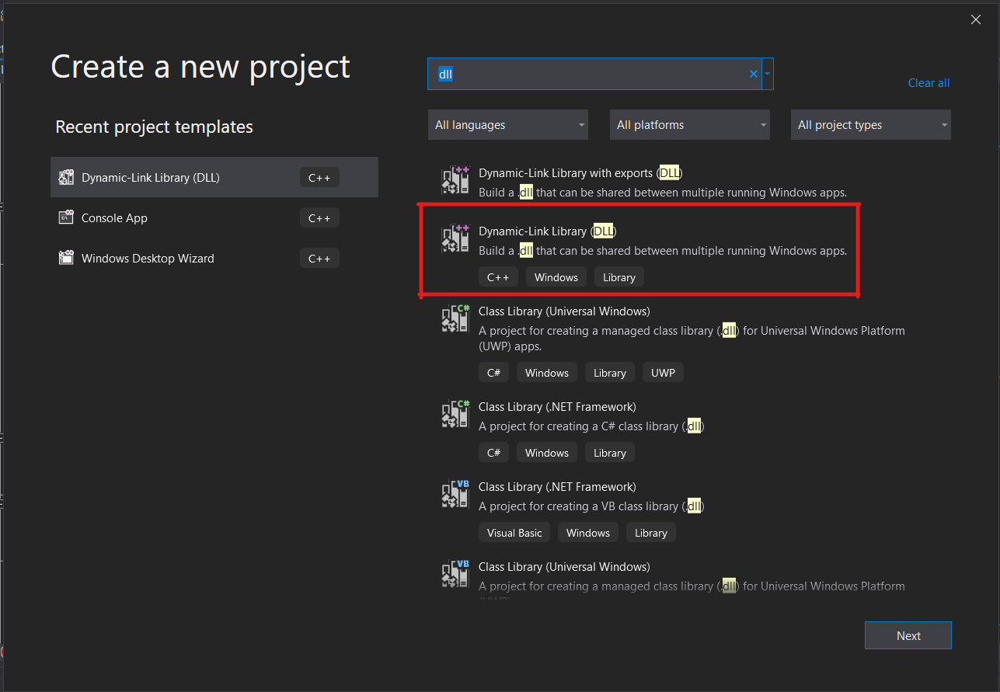

Process injection is the act of writing arbitrary code into an already-running process and executing it. It is used frequently by red teamers, malware authors, and game hackers because it is a powerful detection evasion technique and can gain you read/write/execute access to sensitive information residing in the target process. As a malware reverse engineer, I have looked at quite a few process injection techniques, and _loosely_ understand how they work, but I have never had to implement one. 

There are myriad ways to inject into a running process and every malware author seemingly knows them, but whenever I google "how to inject into a process", I get a bunch of articles that are bogged down in the weeds where they don't need to be, hand-wavey at parts that I felt warrant more explanation, and none of them linked references to the [Widows API docs](https://docs.microsoft.com/en-us/windows/win32/desktop-programming) enough. After reading through a couple of them, this is my attempt to write the article _I_ would have wanted to find. This is the absolute simplest example of process injection I could write and execute on a windows machine.

## DLL Injection via LoadLibrary

Dynamic Link Libraries, or DLLs, are executables designed to contain library code that can be used by multiple programs. One of the ways that a program can call functions from a DLL is via run-time dynamic linking, which is when a DLL is loaded into the process space of program so that its exported functions can be called. This is great for us, because it means DLLs are designed from the get-go to be mapped into the memory of processes and executed! To learn more about DLLs, the microsoft docs are [here.](https://docs.microsoft.com/en-us/windows/win32/dlls/dynamic-link-libraries)


#### What you will need:

* A Windows machine with [Visual Studio](https://visualstudio.microsoft.com/) installed
* A target process to inject into. I use [this command line executable](GITHUB LINK TO THE EXECUTABLE) that prints "Hello World" every 1000 ms for this post.
* A debugger that allows you to step through your injector and injectee when your code isn't working. I recommend [x64dbg.](https://x64dbg.com/#start) 

I won't cover debugging in this tutorial, but if you want an easy-to-follow walkthrough of x64dbg, check out this [tutorial from OALabs](https://www.youtube.com/watch?v=4VBVMKdY-yg) - full disclosure, I work with the guys who run OALabs, but I think they make super high quality tutorials/tools that I use and wholeheartedly recommend to beginner reverse engineers.

## Let's get started!

For this project, we will end up creating two different projects within Visual Studio:

* The payload DLL that will gets injected into our target process
* The injector which loads our payload into the target process and executes it

### Creating the payload DLL

When creating a new project in Visual Studio, search "dll" in the top bar, and select the basic DLL project template.



Once you selected a name and filepath for your project, you will be presented with the following code:

```c++

// dllmain.cpp : Defines the entry point for the DLL application.
#include "pch.h"

BOOL APIENTRY DllMain( HMODULE hModule,
                       DWORD  ul_reason_for_call,
                       LPVOID lpReserved
                     )

{

    switch (ul_reason_for_call)
    {
    case DLL_PROCESS_ATTACH:
    case DLL_THREAD_ATTACH:
    case DLL_THREAD_DETACH:
    case DLL_PROCESS_DETACH:
        break;
    }

    return TRUE;
}

```

This project template contains the skeleton of the `DLLMain` method, which the entry point for a DLL. It is called in 4 scenarios, as evidenced by the switch statement. For more info on each of the 4 scenarios, they are laid out in the [documentation for DLLMain.](https://docs.microsoft.com/en-us/windows/win32/dlls/dllmain) 

For our payload, lets call [MessageBox](https://docs.microsoft.com/en-us/windows/win32/api/winuser/nf-winuser-messagebox) for each case, so we can see when DllMain gets called.

```c++

// dllmain.cpp : Defines the entry point for the DLL application.
#include "pch.h"
#include <Windows.h>

BOOL APIENTRY DllMain( HMODULE hModule,
                       DWORD  ul_reason_for_call,
                       LPVOID lpReserved
                     )
{
    // NOTE: 
    // You can execute code here as well, and it will execute
    // regardless of the value of ul_reason_for_call

    switch (ul_reason_for_call)
    {
    case DLL_PROCESS_ATTACH:
        MessageBox(
            NULL,
            (LPCWSTR)L"DLL_PROCESS_ATTACH",
            (LPCWSTR)L"In DllMain",
            MB_OK
        );
    case DLL_THREAD_ATTACH:
        MessageBox(
            NULL,
            (LPCWSTR)L"DLL_THREAD_ATTACH",
            (LPCWSTR)L"In DllMain",
            MB_OK
        );
    case DLL_THREAD_DETACH:
        MessageBox(
            NULL,
            (LPCWSTR)L"DLL_THREAD_DETACH",
            (LPCWSTR)L"In DllMain",
            MB_OK
        );
    case DLL_PROCESS_DETACH:
        MessageBox(
            NULL,
            (LPCWSTR)L"DLL_PROCESS_DETACH",
            (LPCWSTR)L"In DllMain",
            MB_OK
        );
        break;
    }

    // NOTE: 
    // You can execute code here as well, and it will execute
    // regardless of the value of ul_reason_for_call

    return TRUE;
}

```

After building the project (`ctrl+b`), we can test it with `rundll32.exe`. We need to call an exported function, but since we don't have any in our DLL, we can just call a bogus function `#1`:

```console
C:\Windows\System32\rundll32.exe <path to built DLL> #1
```

This will cause an error, since the we don't have an exported `#1` function, but we can still observe the various DLLMain MessageBoxes.

Great! Now that we have a payload, on to the injector.


### Creating the injector


